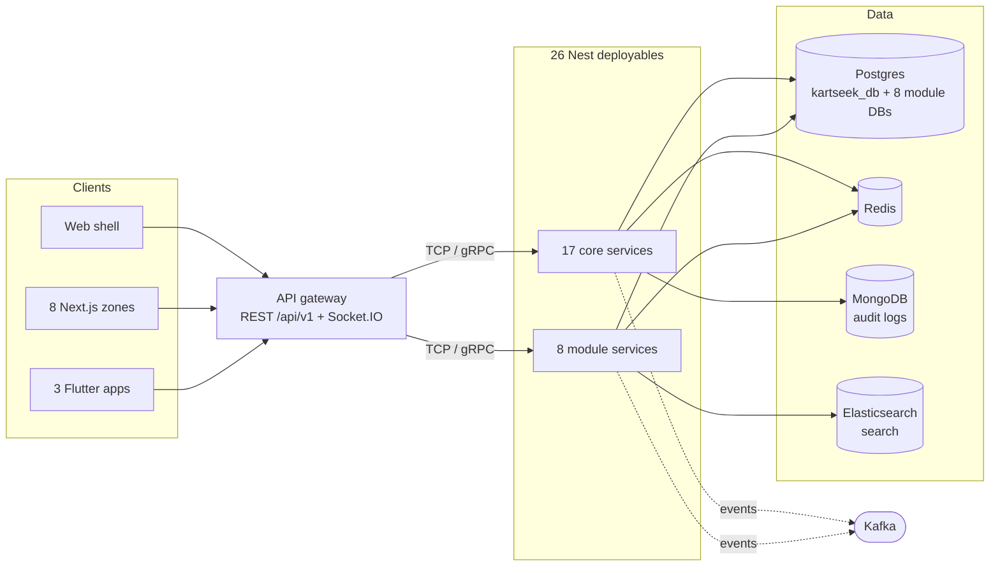

# KARTSEEK architecture

KARTSEEK is a multi-vertical super-app platform — marketplace, grocery,
restaurant, pharmacy, doctor bookings, hotel bookings, taxi, and a franchise
partner console — built as one Nest monorepo behind a single API gateway,
fronted by a Next.js web shell split into per-vertical zones, and by three
independent Flutter mobile apps. This document is for anyone who has not seen
the system before and needs to know what is actually deployed and how a
request actually travels through it, on the `chore/platform-reorg` branch
that is carrying out the reorganization described in
[`docs/superpowers/specs/2026-09-05-platform-reorganization-design.md`](docs/superpowers/specs/2026-09-05-platform-reorganization-design.md).
Every number below is transcribed from [`services.yaml`](services.yaml) or
from a counting command recorded next to it — re-run the command rather than
trusting the prose if the two ever disagree. The linked documents under
`docs/architecture/` and `docs/adr/` carry the depth this file only
summarizes; treat this page as the map, not the territory.

## 1. System at a glance

Every client — the web shell, its 8 zones, and the 3 Flutter apps — speaks
REST (plus Socket.IO for real-time) to one API gateway. The gateway is the
only thing any client talks to directly; it fans requests out to 17 core
services and 8 module services over TCP `@MessagePattern`s or gRPC, and those
services read and write Postgres (one shared database plus one per module),
Redis, MongoDB, and Elasticsearch, and publish and consume Kafka events among
themselves. Sections 3 and 4 below walk through the request and messaging
detail this diagram only outlines.

## 2. Deployables

[`services.yaml`](services.yaml) is the single source of truth for what is
deployed: every build target, port, health route, owned database, and
infrastructure dependency is declared there once, and generators and a drift
check read from it rather than from any hand-maintained list
([`docs/adr/0005-service-registry.md`](docs/adr/0005-service-registry.md)).
Counting its `kind:` field directly:

<!-- counted with: grep -c "kind: gateway" services.yaml && grep -c "kind: core-service" services.yaml && grep -c "kind: module-service" services.yaml && grep -c "kind: web-shell" services.yaml && grep -c "kind: web-zone" services.yaml
     → 1, 17, 8, 1, 8 -->

- **26 Nest deployables**: 1 API gateway, 17 core services
  (`apps/api/apps/*`), 8 module services (`modules/*/backend`).
- **9 Next.js deployables**: 1 web shell (`apps/web`) plus 8 zones
  (`modules/*/frontend`), one per vertical.

That is 35 registry entries in total. Alongside them, 3 independent Flutter
apps (`apps/customer`, `apps/partner`, `apps/seller` — see
[`docs/architecture/mobile.md`](docs/architecture/mobile.md)) and one MCP
server (`apps/mcp-server`) exist in the tree but are not in `services.yaml`,
because they are not deployed as containers the registry manages.

The generated table with every deployable's path, ports, database, and
dependencies is [`docs/architecture/services.md`](docs/architecture/services.md);
it is rebuilt from `services.yaml` by `npm run registry:generate` and is
never hand-edited.

## 3. Request path: `GET /api/v1/marketplace/products`

1. A page under the web shell or one of the zones requests
   `GET /api/v1/marketplace/products?...`. In the browser this normally
   resolves straight to the gateway's own origin via `NEXT_PUBLIC_API_URL`
   (resolved in one place, `packages/shared-core/src/config/api-base.ts`); a
   same-origin, relative call made from the shell is instead rewritten to the
   gateway by the `/api/v1/:path*` rule in `apps/web/next.config.mjs`. Either
   way the request lands at the same gateway.
2. The gateway's global prefix (`api`) and default URI version (`1`) — both
   set in `apps/api/apps/api-gateway/src/main.ts` — mean this is
   `MarketplaceGatewayController`'s `GET products` route
   (`@Controller('marketplace')`,
   `apps/api/apps/api-gateway/src/controllers/marketplace.controller.ts`).
   The controller declares no class-level guard, so this particular route is
   public.
3. Nest's global pipeline runs regardless of the route: `ValidationPipe`,
   then `AllExceptionsFilter`, then the interceptors registered with
   `app.useGlobalInterceptors(...)` in `main.ts` — `LoggingInterceptor`,
   `AuditInterceptor`, `PciComplianceInterceptor`, `TransformInterceptor` —
   plus two enhancers registered as providers in
   `apps/api/apps/api-gateway/src/api-gateway.module.ts`: `ThrottlerGuard`
   (the gateway's only global `APP_GUARD`) and `ActivityTrackingInterceptor`.
4. The handler forwards the parsed query (`page`, `limit`, `category`,
   `subcategory`, `brand`, `seller`, price bounds, `sort`, and the caller's
   resolved region) to marketplace-service over TCP:
   `this.marketplaceClient.send({ cmd: 'get_products' }, payload)` —
   `MARKETPLACE_PATTERNS.GET_PRODUCTS`, declared in
   `apps/api/apps/api-gateway/src/contracts/marketplace.patterns.ts` — with a
   10-second timeout and an `rpcCatch` mapper that forwards a 4xx domain
   message but collapses anything else to a `503` — this specific route has
   no gRPC path. Other catalogue reads on the same controller take different
   paths: `categories`, and `search` when no region is set, call
   `catalogGrpc.*` first, through `apps/api/proto/marketplace.proto`, and
   fall back to this TCP client when gRPC returns nothing. `home` is
   deliberately TCP-only instead — its own comment explains that the proto's
   `HomeResponse` omits several storefront sections, so preferring gRPC there
   once left six sections `undefined` and the client silently substituted
   demo products.
5. marketplace-service's own `@MessagePattern('get_products')` handler runs
   the query against the database it owns, `kartseek_marketplace` (schema
   `marketplace`) — see
   [`docs/architecture/data-ownership.md`](docs/architecture/data-ownership.md).
6. The response passes back through the same interceptor chain.
   `TransformInterceptor` wraps whatever the handler returned as
   `{ success: true, data: <result>, timestamp }`
   (`apps/api/libs/common/src/interceptors/transform.interceptor.ts`).
   Because the handler's own result for a list is already shaped like
   `{ data: [...], total, page, ... }`, the response body nests as
   `{ success: true, data: { data: [...], total, page, ... }, timestamp }` —
   **the rows sit at `json.data.data`, not `json.data`.** This trips people
   reading the payload for the first time; every list endpoint behind
   `TransformInterceptor` behaves the same way.

## 4. Communication

Four transports, each for a different shape of call:

- **REST**, at the edge only. Every client speaks REST to the gateway under
  `/api/v1`; nothing downstream of the gateway is exposed as REST.
- **TCP `@MessagePattern`**, gateway → service, for most core and module
  services. The gateway registers one `ClientsModule` TCP client per service
  in `apps/api/apps/api-gateway/src/api-gateway.module.ts`, and command names
  are declared as constants under
  `apps/api/apps/api-gateway/src/contracts/` (for example
  `MARKETPLACE_PATTERNS` in `contracts/marketplace.patterns.ts`). The
  `send(cmd, payload)` / `send(cmd, payload, fallback)` shape, and what a
  missing handler on the other end actually returns, is covered in
  [`docs/architecture/messaging.md`](docs/architecture/messaging.md).
- **gRPC**, for the 10 services whose `services.yaml` entry declares a `grpc`
  port — `auth-service`, `delivery-service`, `notification-service`,
  `order-service`, `payment-service`, `user-service`, `grocery-service`,
  `marketplace-service`, `restaurant-service`, `taxi-service`. Each has a
  matching `.proto` file in `apps/api/proto/`, wired through
  `GrpcClientModule.register([...])` in the same gateway module file.
  <!-- counted with: git ls-files apps/api/proto | grep -c '\.proto$' → 10 -->
- **Kafka**, for asynchronous domain events between services — order,
  payment and wallet lifecycle events, the audit trail, search indexing.
  Topic ownership, consumer-group scoping per service, and current failure
  behaviour are in
  [`docs/architecture/messaging.md`](docs/architecture/messaging.md).
- **Socket.IO**, from the gateway only, over 10 distinct namespaces —
  `tracking`, `/chat`, `/doctor-queue`, `/franchise`, `hotel`,
  `/notifications`, `/orders`, `/recommendations`, `/seller`, `/taxi`.
  <!-- counted with: grep -rhoE "^  namespace: '[^']+',$" apps/api/apps/api-gateway/src/socket.gateway.ts apps/api/apps/api-gateway/src/gateways/*.gateway.ts | wc -l → 10 -->
  Order tracking lives on `/orders`; how a client is authorized to join one
  order's room, as opposed to merely connecting to the namespace, is in
  [`docs/architecture/security.md`](docs/architecture/security.md).

## 5. Shared backend libraries

11 libraries under `apps/api/libs/`, each imported as `@app/<name>`:

<!-- counted with: git ls-files apps/api/libs | sed -E 's#(apps/api/libs/[^/]+)/.*#\1#' | sort -u | wc -l → 11 -->

| Library           | What it provides                                                                                                                                                                                                                                                           |
| ----------------- | -------------------------------------------------------------------------------------------------------------------------------------------------------------------------------------------------------------------------------------------------------------------------- |
| `@app/common`     | Shared enums (`status`, `country`, `role`), the paginated-response and base-entity interfaces, the HTTP/RPC exception filters, `LoggingInterceptor` and `TransformInterceptor` (the response envelope), the `rpcCatch` RPC-to-HTTP mapper, and the Joi env-schema builder. |
| `@app/database`   | The shared `DatabaseModule` (Postgres/TypeORM registration), `validateDatabaseConfig`/`logDatabaseConfig`, and DB credential helpers.                                                                                                                                      |
| `@app/decorators` | The `@Roles()` decorator and its module.                                                                                                                                                                                                                                   |
| `@app/gdpr`       | GDPR module, service, controller, and the data-retention service.                                                                                                                                                                                                          |
| `@app/grpc`       | The gRPC client/server module, client factory, shared interfaces, and server helpers (re-exported as `GrpcClientModule`).                                                                                                                                                  |
| `@app/guards`     | `RolesGuard` and the `UserRole` enum.                                                                                                                                                                                                                                      |
| `@app/kafka`      | `KafkaModule`, `KafkaProducerService`, `KafkaConsumerService`, and the topic-constants re-export.                                                                                                                                                                          |
| `@app/redis`      | `RedisModule` and `RedisService` (cache and geo store).                                                                                                                                                                                                                    |
| `@app/region`     | Region detection: module, service, config, decorator, guard, and middleware.                                                                                                                                                                                               |
| `@app/security`   | JWT strategy and guard, DDoS-protection middleware, PCI-compliance interceptor, CSRF guard, refresh-token and encryption services, and the resource-ownership guard/decorator pair.                                                                                        |
| `@app/storage`    | Cloud storage module and service (uploads).                                                                                                                                                                                                                                |

Adding a new one is not one registration: every shared library must be
declared in five places for a workspace to resolve `@app/*` the same way
everywhere, and missing one resolves silently to a different file rather than
failing the build — see the rule and its history in
[`docs/adr/0002-nest-monorepo-on-rspack.md`](docs/adr/0002-nest-monorepo-on-rspack.md).

## 6. Frontends

The web frontend is one shell (`apps/web`) plus 8 independent Next.js zones
(`modules/*/frontend`), each its own build and its own origin, stitched
together by the shell's `rewrites()` in `apps/web/next.config.mjs`.
[`docs/architecture/frontend-zones.md`](docs/architecture/frontend-zones.md)
has the full rewrite table, the three web areas that stayed in the shell
instead of becoming zones, and the ADR behind the split
([`docs/adr/0004-next-multi-zone-frontends.md`](docs/adr/0004-next-multi-zone-frontends.md)).

Shared frontend code can only flow through two packages — a zone or the
shell may not import another zone's source tree directly:
`packages/shared-core` (i18n, the API client and endpoints, region/config,
localization data, shared routes) and `packages/shared-ui` (shared
components: app shell, orders, profile, recommendations, SEO, the
marketplace product thumbnail, zone-to-zone links).

The shell registers a PWA — `apps/web/public/manifest.json` and
`apps/web/public/sw.js`, registered from `apps/web/src/app/layout.tsx` — whose
service worker precaches the shell's own top-level routes (`/`,
`/marketplace`, `/restaurant`, `/grocery`, `/pharmacy`, `/doctor`, `/taxi`,
`/offline`) for offline use. The 8 zones and the 3 Flutter apps are outside
this PWA.

## 7. Data

Two ownership models coexist today; the exhaustive table — built by
transcribing every deployable's entities and raw-SQL table access, not by
describing an intended design — is
[`docs/architecture/data-ownership.md`](docs/architecture/data-ownership.md).

- The gateway and the 17 core services default to one shared Postgres
  instance, `kartseek_db`, with **schema-per-service** (`admin`,
  `commission`, `delivery`, `location`, `order`, `payment`, `payout`,
  `refund`, `report`, `user`, `wallet`, plus the gateway's own `public`
  schema). `auth-service` is the exception: it also connects to `public`,
  the gateway's own schema, rather than getting one of its own — the
  shared-`users`-table question
  [`docs/architecture/data-ownership.md`](docs/architecture/data-ownership.md#what-phase-5-must-decide)
  opens with. `cart-service`, `audit-log-service`, `loyalty-service`,
  `notification-service`, and `search-service` own no tables at all
  (`database: null` in `services.yaml`).
- Each of the 8 module services owns its own named database
  (`kartseek_marketplace`, `kartseek_grocery`, `kartseek_restaurant`,
  `kartseek_pharmacy`, `kartseek_doctor`, `kartseek_hotel`,
  `kartseek_taxi`, `kartseek_franchise`). By default these still live as
  separate databases inside the one shared Postgres instance; only Compose's
  `isolated` profile gives each its own dedicated Postgres container (see
  section 9).

Redis backs the response and query cache, the single refresh-token-per-user
store, geo queries (nearby stores and drivers), and the Socket.IO adapter
that lets WebSocket connections fan out across gateway replicas
(`RedisIoAdapter`, `apps/api/apps/api-gateway/src/adapters/redis-io.adapter.ts`).
MongoDB holds the durable audit trail written by `audit-log-service`, which
consumes the Kafka topic the gateway's `AuditInterceptor` publishes to —
nothing else in the registry depends on MongoDB. Elasticsearch backs
full-text search and autocomplete, owned solely by `search-service`, which
indexes from its own `search-indexer` Kafka consumer group.

## 8. Security

The gateway registers no global authentication or authorization guard —
`ThrottlerGuard` is the only `APP_GUARD` in
`apps/api/apps/api-gateway/src/api-gateway.module.ts` — so every
`JwtAuthGuard`/`RolesGuard` pairing is a `@UseGuards(...)` decorator a
controller author had to add themselves, and `@ApiBearerAuth('JWT')` alone draws a
padlock icon in Swagger and enforces nothing. Access tokens expire in 15
minutes and refresh tokens in 7 days by default, with the shared
`apps/api/libs/security` JWT strategy tolerating a missing `role` claim while
`auth-service` runs a second, near-identical strategy of its own. Refresh
tokens are stored one per user in Redis rather than one per device, so a
second login silently signs the first device out the next time it tries to
refresh. `trust proxy` is set to a configured hop count specifically so
per-IP rate limiting and audit logging see the real client address instead of
the reverse proxy's. Seller access additionally passes through an approval
workflow (`users.status` plus `sellers.verificationStatus`) and a WebSocket
client is authorized into a specific room by an HTTP-issued grant rather than
by the room name alone — the full detail, including the dev auth bypass, CSRF
and CORS/CSP configuration, is in
[`docs/architecture/security.md`](docs/architecture/security.md).

## 9. Local and deployed topology

Locally, the root `docker-compose.yml` is an entry point that `include`s
[`infra/docker/compose.infra.yml`](infra/docker/compose.infra.yml) for the
infrastructure containers — Postgres, Redis, Kafka, MongoDB, Elasticsearch,
nginx, and admin tooling — and reads only the repository root's `.env` file.
Module-specific Postgres containers exist in that same compose file but only
start under its `isolated` profile; otherwise every module shares the one
platform Postgres instance, as described in section 7.

Application images are not yet generated per deployable: `infra/docker/`
today holds 3 hand-written Dockerfiles (`api-gateway.Dockerfile`,
`core-service.Dockerfile`, `marketplace-service.Dockerfile`), all built from
the repository root so every image shares the one root lockfile.

<!-- counted with: git ls-files infra/docker | grep -c '\.Dockerfile$' → 3 -->

A Dockerfile and Compose entry for every remaining deployable is Phase 3 of
the reorganization spec (see below).

Kubernetes manifests for the containers that exist today live under
[`infra/k8s/`](infra/k8s/) — its own
[`infra/k8s/README.md`](infra/k8s/README.md) covers what each manifest does
and how to apply them.

CI/CD on GitHub Actions and an observability baseline
(`@app/observability`, Prometheus and Grafana) do not exist yet. Both, along
with Docker images for every deployable and the database-per-service
cutover, are scoped as Phases 2 through 5 of
[`docs/superpowers/specs/2026-09-05-platform-reorganization-design.md`](docs/superpowers/specs/2026-09-05-platform-reorganization-design.md),
which is the place to check what is planned versus what is built.

## 10. Known gaps

This document describes the system as it runs; it does not re-audit it. Nine
audit and remediation reports live under
[`docs/audits/`](docs/audits/), spanning 9 June through 30 August 2026.

<!-- counted with: git ls-files docs/audits | grep -c '\.md$' → 9 -->

The most recent,
[`docs/audits/2026-08-30-frontend-data-audit.md`](docs/audits/2026-08-30-frontend-data-audit.md)
(measured 30 August 2026), found that 161 of 206 web route pages render
hardcoded arrays instead of calling their module's own API, even though the
underlying APIs were verified working. Earlier reports in the same directory
cover other layers — unimplemented gateway message patterns, fabricated
fallback responses, module-isolation boundaries, and marketplace remediation
work.

Section 13 of
[`docs/superpowers/specs/2026-09-05-platform-reorganization-design.md`](docs/superpowers/specs/2026-09-05-platform-reorganization-design.md)
("Out of scope, recorded as follow-ups") is explicit that the platform
reorganization this branch carries out does not change any of that runtime
behaviour — it adds health, metrics, logging, and database wiring, and
leaves the audited gaps for separate work.
