# KARTSEEK API — Backend Architecture

## Overview

KARTSEEK is a multi-regional super-app backend built as a NestJS monorepo of **27 microservices** (+ shared libs). Services communicate via gRPC (synchronous), Kafka (async events), Redis (caching/sessions), WebSockets (real-time), and REST (external clients).

---

## Service Map

```mermaid
graph TB
    subgraph Clients
        WEB[Web App]
        MOBILE[Flutter App]
        ADMIN[Admin Panel]
    end

    subgraph Gateway
        GW[api-gateway :3000]
    end

    subgraph Auth
        AUTH[auth-service :3001]
    end

    subgraph Core Services
        ORDER[order-service]
        PAYMENT[payment-service]
        DELIVERY[delivery-service]
        LOCATION[location-service]
        NOTIFICATION[notification-service]
        SEARCH[search-service]
    end

    subgraph Domain Services
        MARKETPLACE[marketplace-service]
        GROCERY[grocery-service]
        RESTAURANT[restaurant-service]
        PHARMACY[pharmacy-service]
        DOCTOR[doctor-service]
        HOTEL[hotel-service]
        TAXI[taxi-service]
        SELLER[seller-service]
    end

    subgraph Finance
        WALLET[wallet-service]
        PAYOUT[payout-service]
        COMMISSION[commission-service]
        REFUND[refund-service]
        LOYALTY[loyalty-service]
    end

    subgraph Platform
        ADMIN_SVC[admin-service]
        AUDIT[audit-log-service]
        REPORT[report-service]
        FRANCHISE[franchise-service]
        USER[user-service]
        CART[cart-service]
    end

    subgraph Infrastructure
        PG[(PostgreSQL)]
        MONGO[(MongoDB)]
        REDIS[(Redis)]
        KAFKA[Kafka]
    end

    WEB & MOBILE & ADMIN --> GW
    GW -->|gRPC| AUTH
    GW -->|gRPC| ORDER & PAYMENT & SELLER & USER
    GW -->|HTTP| MARKETPLACE & GROCERY & RESTAURANT & PHARMACY & DOCTOR & HOTEL & TAXI
    GW -->|WS| NOTIFICATION

    ORDER & PAYMENT & SELLER -->|Kafka events| KAFKA
    KAFKA --> NOTIFICATION & AUDIT & REPORT & PAYOUT & COMMISSION

    GW & ORDER & SELLER --> REDIS
    ORDER & SELLER & USER --> PG
    SEARCH & AUDIT --> MONGO
```



---

## Kafka Topic Registry

| Topic | Producer | Consumers | Payload |
|---|---|---|---|
| `order.created` | order-service | notification, commission, audit | `{orderId, customerId, serviceType, totalAmount}` |
| `order.status_updated` | order-service | notification, delivery, audit | `{orderId, status, previousStatus, updatedBy}` |
| `order.accepted` | seller-service | delivery, notification | `{orderId, sellerId}` |
| `order.rejected` | seller-service | notification, refund | `{orderId, sellerId, reason}` |
| `order.packed` | seller-service | delivery | `{orderId, sellerId}` |
| `order.shipped` | seller-service | delivery, notification | `{orderId, sellerId, trackingInfo}` |
| `payment.completed` | payment-service | order, wallet, commission | `{paymentId, orderId, amount, method}` |
| `payment.failed` | payment-service | order, notification | `{paymentId, orderId, reason}` |
| `seller.registered` | seller-service | notification, audit | `{sellerId, email, countryCode}` |
| `seller.product.created` | seller-service | search, admin | `{productId, sellerId, countryCode}` |
| `seller.product.updated` | seller-service | search | `{productId, sellerId}` |
| `payout.requested` | seller-service | payout | `{payoutId, sellerId, amount}` |
| `inventory.updated` | seller-service | search, marketplace | `{productId, stock, sellerId}` |
| `return.approved` | seller-service | refund, wallet | `{returnId, sellerId}` |

---

## Redis Key Schema

| Pattern | TTL | Content |
|---|---|---|
| `order:{orderId}` | 24h | Full order object |
| `order:status:{orderId}` | 24h | Last broadcast OrderStatusPayload |
| `tracking:{orderId}` | 1h | Driver coords + name |
| `rt:{token}` | 7d | RefreshTokenPayload (userId, role, familyId) |
| `rt_family:{familyId}` | 30d | Set of token UUIDs in family |
| `jwt:blacklist:{jti}` | Token TTL | Revoked JWT jti → `1` |
| `region:{cc}:seller:{id}` | 5min | Seller profile |
| `ws:orders:sessions` | Session | Hash: socketId → {userId, role} |
| `delivery:locations` | Sorted set | Geospatial: partner coordinates |
| `delivery:location:{orderId}` | 1h | Last known driver location |
| `session:lockout:{userId}` | 15min | Login failure count |

---

## gRPC Service Definitions

```protobuf
// auth.proto
service AuthService {
  rpc ValidateToken(ValidateTokenRequest) returns (ValidateTokenResponse);
}

message ValidateTokenRequest { string token = 1; }
message ValidateTokenResponse {
  bool is_valid = 1;
  string user_id = 2;
  string role = 3;
}
```

---

## Environment Variables

| Variable | Required | Description |
|---|---|---|
| `JWT_SECRET` | ✅ | HS256 signing secret (min 32 chars) |
| `JWT_EXPIRES_IN` | ✅ | Access token TTL (e.g. `900` = 15min) |
| `ENCRYPTION_KEY` | ✅ | 64-char hex, 32 bytes, AES-256-GCM key |
| `INTERNAL_API_KEY` | ✅ | Shared key for service-to-service calls |
| `DATABASE_URL` | ✅ | PostgreSQL connection string |
| `MONGODB_URI` | ✅ | MongoDB connection string |
| `REDIS_URL` | ✅ | Redis connection URL |
| `KAFKA_BROKERS` | ✅ | Comma-separated Kafka broker list |
| `ALLOWED_ORIGINS` | ✅ | CORS whitelist (comma-separated URLs) |
| `NODE_ENV` | ✅ | `development` / `production` / `test` |
| `PORT` | — | API Gateway port (default: 3000) |
| `SLACK_WEBHOOK_URL` | — | Deployment notifications |

---

## Security Architecture

```
Client Request
    │
    ▼
[Helmet CSP + CORS whitelist]
    │
    ▼
[DDoS Protection Middleware] ← block if > 100 req/min per IP
    │
    ▼
[Rate Limiter] ← Throttler: 200/min general, 5/min /auth/login
    │
    ▼
[JWT Auth Guard] ← verify signature + exp + jti blacklist
    │
    ▼
[Roles Guard] ← RBAC: CUSTOMER | SELLER | ADMIN | DELIVERY
    │
    ▼
[Input Sanitizer Middleware] ← strip XSS, SQL injection patterns
    │
    ▼
[Controller / Handler]
    │
    ▼
[PCI Compliance Interceptor] ← mask card data in logs
    │
    ▼
[Transform Interceptor] ← wrap in { success, data, timestamp }
```

---

## Local Development

```bash
# 1. Start infrastructure
cd apps/api && npm run docker:infra

# 2. Copy and fill environment
cp .env.example .env

# 3. Start API gateway (watches for changes)
npm run dev

# 4. Start all services (optional)
npm run dev:all

# 5. View Swagger docs
open http://localhost:3000/api/docs

# 6. Run tests
npm test                # unit tests
npm run test:cov        # with coverage
npm run test:watch      # watch mode
```

---

## Testing Strategy

| Layer | Tool | Target |
|---|---|---|
| Unit | Jest + `@nestjs/testing` | 80%+ on auth, order, seller |
| Integration | Jest + Supertest | Full lifecycle: auth → order → deliver |
| Contract | — | Planned (Pact for gRPC) |
| Load | — | Planned (k6) |
