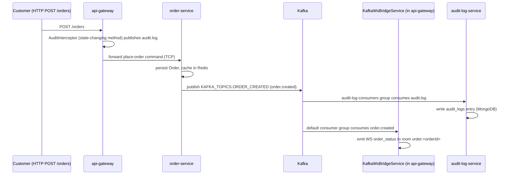

# Messaging: Kafka events and TCP commands

This document is for anyone adding a new event, wiring a new consumer, or
tracing why a gateway route returned what it did. It covers the two
inter-service transports in play — Kafka for fire-and-forget domain events,
and TCP `@MessagePattern` for request/response commands from the gateway to a
service — where each one's source of truth lives, how consumer groups are
scoped per service, and what actually happens today when a TCP call fails.

## Kafka topics

The platform's Kafka topics are declared in exactly one place:
[`apps/api/libs/kafka/src/kafka-topics.constants.ts`](../../apps/api/libs/kafka/src/kafka-topics.constants.ts)
(`KAFKA_TOPICS`). `apps/api/scripts/create-kafka-topics.js` reads that file's
source with a regex — not an import — specifically so topic creation can
never drift from what services actually publish to; it provisions every name
found there and nothing else, since the broker runs with
`KAFKA_AUTO_CREATE_TOPICS_ENABLE: 'false'` and a topic nobody created does not
spring into existence on first publish. `KAFKA_TOPICS` is also what call
sites actually import — a dozen files across the gateway and its services
reference it — so it is the live catalogue, not aspirational.

Transcribed below, grouped exactly as the source file groups them:

- **Order lifecycle**: `order.created`, `order.status_updated`,
  `order.cancelled`, `order.completed`
- **User lifecycle**: `user.registered`, `auth.password_reset.requested`
- **Payment**: `payment.success`, `payment.failed`, `payment.refund.initiated`
- **Wallet**: `wallet.credited`, `wallet.debited`, `wallet.topup.completed`,
  `wallet.frozen`, `wallet.unfrozen`
- **Loyalty**: `loyalty.points.awarded`, `loyalty.points.redeemed`,
  `loyalty.points.reversed`
- **Notifications**: `notification.push`, `notification.sms`,
  `notification.email`, `notification.promo.broadcast`
- **Restaurant**: `restaurant.approved`, `restaurant.status.changed`,
  `restaurant.menu_item.created`, `restaurant.table.booked`
- **Grocery**: `grocery.order.created`, `grocery.order.status_updated`,
  `grocery.category.updated`, `grocery.store.approved`,
  `grocery.store.suspended`, `grocery.inventory.low_stock`,
  `grocery.delivery.requested`, `grocery.product.created`,
  `grocery.product.approved`, `grocery.product.rejected`
- **Doctor**: `doctor.appointment.booked`, `doctor.appointment.updated`,
  `doctor.appointment.cancelled`, `doctor.appointment.completed`,
  `doctor.registered`, `doctor.status_changed`, `doctor.token.advanced`,
  `doctor.queue.updated`, `doctor.appointment.reminder`
- **Taxi ride lifecycle**: `taxi.ride.requested`,
  `taxi.ride.status_updated`, `taxi.ride.completed`, `taxi.ride.cancelled`,
  `taxi.ride.no_driver`
- **Taxi dispatch pipeline**: `taxi.ride.request_sent`,
  `taxi.ride.driver_accepted`, `taxi.ride.driver_rejected`,
  `taxi.ride.driver_timeout`
- **Taxi driver state**: `taxi.driver.status_changed`,
  `taxi.driver.location_updated`
- **Taxi surge & analytics**: `taxi.surge.activated`,
  `taxi.surge.deactivated`
- **Delivery**: `delivery.partner.assigned`, `delivery.status.updated`,
  `delivery.request.created`, `delivery.partner.location`,
  `delivery.partner.online`, `delivery.partner.offline`,
  `delivery.fee.calculated`
- **Flash deals**: `flash_deal.created`, `flash_deal.updated`,
  `flash_deal.started`, `flash_deal.ended`,
  `flash_deal.nomination.submitted`, `flash_deal.nomination.approved`,
  `flash_deal.nomination.rejected`
- **Seller & marketplace**: `seller.registered`, `seller.approved`,
  `seller.rejected`, `seller.suspended`, `seller.blocked`,
  `seller.reactivated`, `seller.product.created`, `product.approved`,
  `product.rejected`, `product.updated`, `product.suspended`,
  `inventory.updated`, `marketplace.home.updated`,
  `marketplace.order.placed` (per seller, distinct from `order.created`
  which carries the customer's whole basket with no seller attached)
- **Franchise**: `franchise.registered`, `franchise.compliance.submitted`,
  `franchise.marketplace.seller_status_updated`
- **Refund**: `refund.requested`, `refund.approved`, `refund.rejected`
- **Commission & payout**: `commission.calculated`, `payout.requested`,
  `payout.processed`
- **Admin / platform**: `admin.user.banned`, `admin.kyc.approved`,
  `admin.kyc.submitted`
- **Audit**: `audit.log`
- **Search**: `search.performed`
- **GDPR & privacy**: `gdpr.consent.granted`, `gdpr.consent.revoked`,
  `gdpr.data.export.requested`, `gdpr.data.export.completed`,
  `gdpr.data.erasure.requested`, `gdpr.data.erasure.completed`
- **Partner lifecycle**: `partner.registered`, `partner.status.changed`,
  `partner.location.updated`
- **Safety & emergency**: `emergency.sos_triggered`, `taxi.sos.triggered`
- **Return requests**: `marketplace.return.created`,
  `marketplace.return.status_updated`, `marketplace.return.pickup_assigned`
- **Coupons**: `marketplace.coupon.redeemed`, `marketplace.coupon.expired`
- **Shipment tracking**: `marketplace.shipment.tracking_updated`
- **Product variants**: `marketplace.variant.low_stock`
- **Product Q&A**: `marketplace.qa.question_posted`,
  `marketplace.qa.answer_posted`
- **Delivery assignment**: `marketplace.delivery.assigned`
- **Pharmacy**: `pharmacy.order.created`, `pharmacy.order.status_updated`,
  `pharmacy.order.completed`, `pharmacy.prescription.uploaded`,
  `pharmacy.prescription.verified`, `pharmacy.store.approved`,
  `pharmacy.store.suspended`, `pharmacy.low_stock`,
  `pharmacy.delivery.requested`, `pharmacy.delivery.completed`
- **Doctor appointments (additional)**: `doctor.appointment.rescheduled`
- **Doctor prescriptions**: `doctor.prescription.issued`,
  `doctor.prescription.dispensed`, `doctor.prescription.to_pharmacy`,
  `pharmacy.order.from_prescription`
- **Centralized payment (v2)**: `payment.v2.initiated`,
  `payment.v2.processing`, `payment.v2.completed`, `payment.v2.failed`,
  `payment.v2.refund.requested`, `payment.v2.refund.completed`,
  `payment.v2.preauth.created`, `payment.v2.preauth.captured`,
  `payment.v2.preauth.released`
- **Invoice**: `invoice.generated`, `invoice.sent`,
  `invoice.download.requested`
- **Settlement**: `settlement.created`, `settlement.settled`,
  `settlement.failed`
- **Taxi real-time billing**: `taxi.billing.preauth`,
  `taxi.billing.meter_updated`, `taxi.billing.captured`,
  `taxi.billing.cancelled`, `taxi.billing.preauth.failed`,
  `taxi.billing.capture.failed`
- **Hotel bookings**: `hotel.booking.confirmed`, `hotel.booking.cancelled`,
  `hotel.guest.checked_in`, `hotel.guest.checked_out`,
  `hotel.room.availability_changed`, `hotel.price.changed`
- **Recommendation engine**: `user.activity.tracked`,
  `recommendation.generated`, `recommendation.clicked`,
  `recommendation.trending.computed`

### A second, unused catalogue

[`apps/api/apps/api-gateway/src/contracts/domain-events.ts`](../../apps/api/apps/api-gateway/src/contracts/domain-events.ts)
declares a second set of event names — `MARKETPLACE_EVENTS`,
`GROCERY_EVENTS`, `RESTAURANT_EVENTS`, `TAXI_EVENTS`, `HOTEL_EVENTS`,
`DOCTOR_EVENTS`, `WALLET_EVENTS`, `LOYALTY_EVENTS`, `FRANCHISE_EVENTS`,
`RECOMMENDATION_EVENTS` — under a different naming convention
(`marketplace.order.placed` rather than `marketplace.order.placed`'s own
`KAFKA_TOPICS.MARKETPLACE_ORDER_PLACED`, for example, or
`marketplace.product.created` where `KAFKA_TOPICS` has no equivalent at all).
Nothing outside this file and its own re-export in `contracts/index.ts`
imports these constants — no `.publish()` call and no `@EventPattern` uses
them. Treat `KAFKA_TOPICS` as the only real event catalogue; `domain-events.ts`
is dead code describing a naming scheme the platform does not run.

## Identity is declared; producers join no group

[`apps/api/libs/kafka/src/kafka.module.ts`](../../apps/api/libs/kafka/src/kafka.module.ts)
is registered by every service as `KafkaModule.forService('<name>')`, where
the name is the service's `name` in `services.yaml` (`marketplace-service`,
`api-gateway` …). An explicit `SERVICE_NAME` environment variable overrides
it — that is how one image can run under another name — and a blank name
throws at boot. There is deliberately **no fallback**.

The previous version _derived_ the identity from how the process happened to
be started: the npm lifecycle event, then the working directory, then
`require.main.filename`, then a shared `'app'`. Two of those never worked in
the shapes the platform actually runs — `require.main` is undefined inside an
rspack bundle, which is every `dist/main.js` this repository builds, and the
smoke harness and the container images start processes with no npm
lifecycle — so every core service in those runs fell through to `'app'` and
joined one group, `kartseek-consumers-app-client`, identifying as
`kartseek-gateway-app-client`. That reproduced the original incident (the
rebalance storm on every start/stop/reload, and reply misrouting between
members sharing one group's partitions) under a new name.

Every `ClientKafka` the factory builds is **producer-only**
(`producerOnlyMode: true`). Nothing on the platform uses Kafka request/reply
— every `.send()` goes to a TCP `ClientProxy`, and Kafka carries
fire-and-forget domain events only — so the consumer Nest would otherwise
create per client subscribed to nothing and existed only to join a group.
Twenty-odd groups with one idle member each, every one rebalancing on every
restart, and every ungraceful restart (hot reload, `taskkill /F`) leaving a
dead member behind that blocked the next join for the rest of its session
timeout: 12.7 s and 20.2 s measured on the broker on 2026-09-13. With no
consumer there is no membership and nothing to wait for. `app.enableShutdownHooks()`
is on in every `main.ts`, so a signal the process can catch closes the
producer cleanly; `KafkaProducerService.health()` answers a bounded
`describeCluster()` probe for readiness checks.

`KAFKA_CLIENT_ID` is no longer read by the library (clients are named
`kartseek-<name>`; Nest appends `-client`). `KAFKA_GROUP_ID` is only the
prefix of the gateway's WebSocket-bridge group below.

### The four real consumers

- **`api-gateway`**'s Kafka → WebSocket bridge (`KafkaConsumerService`),
  group `kartseek-consumers-event-bridge-<hostname>-<pid>` — one group **per
  instance**, on purpose: the bridge feeds socket rooms held by that process
  alone, so every replica must receive every event; a group shared between
  replicas would split the partitions between them and each replica would
  miss the events for half of its own sockets. Empty groups left behind by
  restarts are garbage-collected by the broker after
  `offsets.retention.minutes`.

Three services do not go through the shared factory at all and set a literal
`groupId` in their own bootstrap instead:

- **`audit-log-service`** — `apps/api/apps/audit-log-service/src/main.ts`,
  group `audit-log-consumers`.
- **`search-service`** — `apps/api/apps/search-service/src/main.ts`, group
  `search-indexer`. This is what keeps the search index in step with
  `product.approved` / `product.rejected` / `product.updated` /
  `product.suspended`.
- **`notification-service`**'s password-reset path —
  `apps/api/apps/notification-service/src/password-reset.consumer.ts`, group
  `notification-password-reset`, subscribing to
  `auth.password_reset.requested`. This consumer needs Kafka enabled,
  `notification-service` actually running, and a configured SendGrid key —
  the endpoint that triggers a reset reports success regardless of whether
  any of the three is true, so a missing email here does not surface as an
  API error.

## TCP request/response: `@MessagePattern`

[`apps/api/apps/api-gateway/src/contracts/service-patterns.ts`](../../apps/api/apps/api-gateway/src/contracts/service-patterns.ts)
mirrors the `@MessagePattern({ cmd })` strings each microservice controller
registers — `GROCERY_PATTERNS`, `RESTAURANT_PATTERNS`, `PHARMACY_PATTERNS`,
`TAXI_PATTERNS` and more, one constants object per module. The gateway's
controllers call `ClientProxy.send({ cmd }, payload)` against these strings
over the TCP clients registered in `api-gateway.module.ts` (see
[`services.md`](./services.md) for the TCP ports).

### Failure handling: mostly fixed, one deliberate exception

Every gateway controller wraps its TCP calls in a private `send<T>(cmd,
payload)` helper. Fifteen of them — `admin-core`, `admin-doctor`,
`admin-grocery`, `admin-hotel`, `admin-pharmacy`, `admin-restaurant`,
`admin-taxi`, `doctor`, `franchise`, `grocery`, `hotel`, `loyalty`, `pharmacy`,
`restaurant` and `wallet` controllers — propagate a real failure: a downstream
4xx passes through with its own status, and anything else (timeout, no
handler registered, connection refused) becomes a `503 Service Unavailable`
through the shared `toHttpException` / `rpcCatch` helpers in
`apps/api/libs/common/src/rpc/forward-rpc.ts`. `admin-doctor.controller.ts`'s
own comment documents the change directly: "This helper used to take a
`fallback` and return it as a 200 whenever the service was unreachable... The
fallback parameter is gone; failures propagate and the client can tell the two
apart." This is the fix for the fabricated-200 pattern earlier audits
recorded (see [`../audits/2026-07-25-audit-report.md`](../audits/2026-07-25-audit-report.md) and
[`../audits/2026-07-27-module-isolation-audit.md`](../audits/2026-07-27-module-isolation-audit.md)
for the `@MessagePattern` coverage gaps that made an unimplemented handler
indistinguishable from a slow one) — those documents describe an earlier
state of the code and should be read as history, not as the current failure
behaviour.

One controller keeps an explicit, narrower fallback:
`seller-marketplace.controller.ts` defines two helpers side by side —
`forwardOrThrow()`, used for writes, which passes a downstream 4xx through and
turns everything else into a `ServiceUnavailableException`; and `sendTo()`,
used only for reads, which degrades to a caller-supplied empty-shaped default
(e.g. an empty list) on any failure. The file's own comment states the
reasoning: "`sendTo` swallows everything into a fallback, which is right for a
read (\"show an empty list\") and wrong for a write: a seller who is told
their approval, refusal or stock change succeeded when it did not has been
actively misled." Treat this controller as the one place a TCP failure is
still absorbed rather than surfaced, and only for reads.

## Sequence: what actually consumes an order placement

Tracing `order.created` and the audit trail together, rather than assuming
who subscribes to what:

Two independent things happen, on two different topics, not one topic with
two subscribers: `AuditInterceptor` (gateway-side) publishes `audit.log` for
every mutating HTTP request, which `audit-log-service` is the sole consumer
of; `order-service` separately publishes `order.created`, which
`api-gateway`'s own `KafkaWsBridgeService` consumes to push a live
`order_status` event into the order's WebSocket tracking room. Joining that
room requires a grant recorded by `WsTrackingGrantService`
(`apps/api/apps/api-gateway/src/services/ws-tracking-grant.service.ts`) —
see [`security.md`](./security.md) for how that grant is issued.

**`notification-service` is not a consumer of `order.created` today**, despite
the order-placement endpoint's own Swagger description
(`order.controller.ts`) stating it "emits `order.created` to Kafka for async
inventory/notification processing." `notification-service`'s only Kafka
subscription is `PasswordResetConsumer`'s dedicated listener on
`auth.password_reset.requested` (see above); everything else it does —
`send_push` and the rest — is invoked directly over gRPC by whichever service
wants a notification sent, not driven by a Kafka subscription. Documented
intent and current wiring disagree here.

## Related

- [`services.md`](./services.md) for every service's Kafka/TCP dependency and
  port.
- [`data-ownership.md`](./data-ownership.md) for what each service backing a
  `@MessagePattern` handler actually persists.
- [Database migrations guide](../guides/database-migrations.md) and
  [running services guide](../guides/running-services.md) for how to bring
  Kafka up locally and what `SKIP_KAFKA` does.
